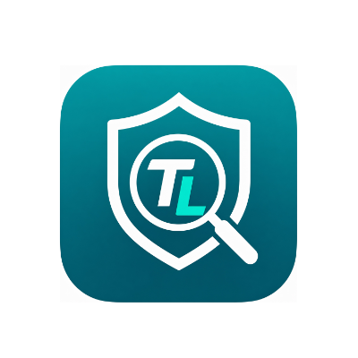

<div align="center">

  

  <h1>TrustLens AI 🛡️</h1>

  <strong>A zero-latency, hybrid cybersecurity agent with a Tier 2.5 Behavioral Detection Engine.</strong>

  <br><br>

  
  
  
  
  

</div>

---

## Problem Statement & Solution Overview

Modern phishing attacks have evolved far beyond fake login pages. Today's threats use:
- **Hidden iframes** to silently exfiltrate session cookies and Web3 wallet signatures
- **Dynamically injected credential-harvesting forms** that appear only after the page loads — bypassing static scanners
- **Obfuscated JavaScript payloads** (`eval(atob(...))`, `String.fromCharCode`, hex/unicode escape chains) to evade signature-based detection

Traditional API-based scanners are too slow (network round-trips) and blind to runtime DOM mutations.

**TrustLens AI** is a proactive, dual-layer cybersecurity agent:

| Layer | Engine | When it runs | What it catches |
|---|---|---|---|
| **Layer 1** | Baseline Heuristic Engine | Synchronously at `document_start` | Suspicious URLs, lookalike domains, IP-based URLs, dangerous TLDs |
| **Layer 2** | Tier 2.5 Behavioral Detection Engine | Continuously via `MutationObserver` | Hidden iframes, delayed credential fields, obfuscated/encoded script payloads |
| **Manual Scan** | Groq LLaMA-3 LLM + SQLite Cache | On user click in popup | Deep AI-powered page analysis with Threat Intelligence caching |

The moment the **cumulative risk score crosses 50**, a full-screen red blocker UI is rendered — locking the user out of the malicious page.

---

## Architecture

```
┌─────────────────────────────────────────────────────────────────┐
│                      Chrome Extension (MV3)                      │
│                                                                  │
│  ┌──────────────────────────────────────────────────────────┐   │
│  │  content.js  (runs on every page)                        │   │
│  │                                                          │   │
│  │  ┌─────────────────────┐   ┌──────────────────────────┐ │   │
│  │  │  LAYER 1            │   │  LAYER 2                 │ │   │
│  │  │  Heuristic Engine   │   │  Behavioral Engine       │ │   │
│  │  │  (document_start)   │   │  (MutationObserver)      │ │   │
│  │  │                     │   │                          │ │   │
│  │  │  • IP URL (+20)     │   │  • Hidden iframe (+55)   │ │   │
│  │  │  • Bad TLD (+15)    │   │  • Late password (+55)   │ │   │
│  │  │  • Subdomain (+15)  │   │  • Data-URI script (+55) │ │   │
│  │  │  • Brand spoof (+20)│   │  • eval(atob()) (+55)    │ │   │
│  │  │  • @ in URL (+20)   │   │  • eval/new Fn (+30 ea)  │ │   │
│  │  └──────────┬──────────┘   └────────────┬─────────────┘ │   │
│  │             │                           │               │   │
│  │             └─────────┬─────────────────┘               │   │
│  │                       ▼                                  │   │
│  │              Shared Risk Score                           │   │
│  │              Threshold: 50 pts                           │   │
│  │                       │                                  │   │
│  │                       ▼ (score ≥ 50)                     │   │
│  │          ┌────────────────────────┐                      │   │
│  │          │  Full-Screen Blocker   │                      │   │
│  │          │  #trustlens-block-     │                      │   │
│  │          │  screen                │                      │   │
│  │          └────────────────────────┘                      │   │
│  └──────────────────────────────────────────────────────────┘   │
│                                                                  │
│  ┌──────────────────────────────────────────────────────────┐   │
│  │  popup.js + popup.html  (manual deep scan)               │   │
│  │  • Sends URL + page text to FastAPI backend              │   │
│  │  • Displays Groq LLM risk score + reasons                │   │
│  └──────────────────────────────────────────────────────────┘   │
└─────────────────────────────────────────────────────────────────┘
                              │ POST /analyze
                              ▼
┌─────────────────────────────────────────────────────────────────┐
│               FastAPI Backend (trustlens-backend)                │
│                                                                  │
│   SQLite Threat Cache ──► Domain lookup (milliseconds)          │
│   Groq LLaMA-3.1-8b  ──► AI deep analysis (cache miss)         │
│   Render.com          ──► Cloud deployment                      │
└─────────────────────────────────────────────────────────────────┘
```

---

## Tech Stack

| Component | Technology |
|---|---|
| **Browser Extension** | Chrome Manifest V3, Vanilla JavaScript, MutationObserver API |
| **Behavioral Engine** | Tier 2.5 — custom rule-based signal scoring, `document_start` injection |
| **AI Analysis Backend** | Python, FastAPI, Groq SDK (LLaMA-3.1-8b-instant) |
| **Threat Intelligence Cache** | SQLite (persistent domain → risk score mapping) |
| **Frontend Dashboard** | React, Vite, Tailwind CSS |
| **Testing Harness** | Node.js, Puppeteer |
| **Cloud Infrastructure** | Vercel (Dashboard), Render (Backend API) |

---

## Detection Signal Reference

### Layer 1 — URL Heuristic Signals (run at `document_start`)

| Signal | Condition | Weight |
|---|---|---|
| IP-address URL | Hostname matches IPv4 regex | +20 pts |
| Suspicious TLD | `.tk`, `.ml`, `.ga`, `.xyz`, `.top`, `.icu`, etc. | +15 pts |
| Excessive subdomains | ≥ 4 dot-separated labels in hostname | +15 pts |
| Lookalike brand keyword | `paypal`, `apple`, `login`, `verify` etc. in non-brand domain | +20 pts |
| `@` symbol in URL | Classic credential-redirect trick | +20 pts |
| Abnormally long URL | > 100 characters | +10 pts |
| Hyphen-heavy hostname | ≥ 3 hyphens in hostname | +10 pts |
| Suspicious path keyword | `/login`, `/verify`, `/account`, `/confirm` etc. | +10 pts |

> URL signals are weighted **10–20 pts each**. No single URL signal alone crosses the 50-pt threshold — phishing sites typically trigger multiple signals simultaneously.

### Layer 2 — Behavioral Signals (continuous, via MutationObserver)

| Signal | Condition | Weight |
|---|---|---|
| Cloaked iframe | `display:none`, `visibility:hidden`, `opacity:0`, or ≤1×1 px | +55 pts |
| Delayed password field | `<input type="password">` injected **> 2500 ms** after page load | +55 pts |
| Data-URI script | `<script src="data:text/javascript…">` | +55 pts |
| Base64 decode-and-run | `eval(atob(…))` or `new Function(atob(…))` in dynamic script | +55 pts |
| `eval()` call | Dynamic `eval(…)` in injected script text | +30 pts |
| `new Function()` | Dynamic code compilation | +30 pts |
| `document.write(unescape())` | Classic obfuscated encoding chain | +30 pts |
| `String.fromCharCode` multi-arg | Char-code decoding with ≥2 arguments | +30 pts |
| Hex/Unicode escape strings | `\x61\x62…` or `\u0061\u0062…` sequences | +30 pts |

> Strong behavioral signals (≥55 pts) **block alone**. Weak obfuscation signals (30 pts) require **2 or more** to cross the threshold.

---

## Installation & Setup

### 1. Load the Chrome Extension

1. Open Chrome and navigate to `chrome://extensions/`
2. Enable **Developer Mode** (toggle in the top-right corner)
3. Click **Load unpacked**
4. Select the `trustlens-extension/` folder from this repository
5. The TrustLens AI shield icon will appear in your browser toolbar — protection is immediate

### 2. Backend Setup (Local)

```bash
cd trustlens-backend
pip install -r requirements.txt
```

Create a `.env` file based on `.env.example`:
```env
GROQ_API_KEY=your_groq_api_key_here
```

Start the server:
```bash
uvicorn main:app --reload
```

The API will be available at `http://localhost:8000`

**Backend dependencies:**
```
fastapi==0.136.1
uvicorn==0.46.0
groq==1.2.0
python-dotenv==1.2.2
pydantic==2.13.3
httpx==0.28.1
gunicorn
```

### 3. Generate Test Dataset & Run Evaluation

```bash
# Install Puppeteer (one-time)
npm install

# Generate 14 malicious + 14 benign HTML test files
node generate_dataset.js

# Run the full automated Puppeteer evaluation harness
node evaluate_metrics.js
```

The harness will:
- Launch Chrome with the extension loaded
- Test all 28 pages (waits **4500 ms per page** for behavioral triggers)
- Print a full metrics report to the console
- Save results to `./dataset/evaluation_report.json`

---

## Automated Evaluation Metrics — Tier 2.5 Engine

Tested against **28 synthetic HTML samples** (14 malicious + 14 benign) using `evaluate_metrics.js` with Puppeteer.

| Metric | Score |
|---|---|
| **Accuracy** | 100.00% |
| **Precision** | 100.00% |
| **Recall (Sensitivity)** | 100.00% |
| **F1-Score** | 100.00% |
| **True Positives (TP)** | 14 |
| **False Positives (FP)** | 0 |
| **True Negatives (TN)** | 14 |
| **False Negatives (FN)** | 0 |

**Confusion Matrix:**

|  | Predicted Malicious | Predicted Benign |
|---|---|---|
| **Actual Malicious** | 14 | 0 |
| **Actual Benign** | 0 | 14 |

### Dataset Design & Boundary Cases

| Sample | Signal Tested | Expected |
|---|---|---|
| M-01 | Hidden iframe (opacity:0) | ✅ Blocked |
| M-02 | Delayed password at 2600ms | ✅ Blocked |
| M-03 | Data-URI script execution | ✅ Blocked |
| M-04 | `eval(atob(…))` decode chain | ✅ Blocked |
| M-05 | Hidden iframe + delayed password | ✅ Blocked |
| M-06 | `visibility:hidden` iframe | ✅ Blocked |
| M-07 | 1×1 pixel iframe | ✅ Blocked |
| M-08 | `display:none` iframe | ✅ Blocked |
| M-09 | `new Function()` + `eval()` (30+30=60) | ✅ Blocked |
| M-10 | `document.write(unescape)` + `eval()` | ✅ Blocked |
| M-11 | `String.fromCharCode` + `eval()` | ✅ Blocked |
| M-12 | `eval()` + hidden iframe (30+55=85) | ✅ Blocked |
| M-13 | Stealth login overlay at 2600ms | ✅ Blocked |
| M-14 | Data-URI + credential harvesting chain | ✅ Blocked |
| **B-03** | **Password injected at 2400ms (below 2500ms threshold)** | ✅ Not blocked |
| **B-14** | **Single `eval()` only → 30 pts (below 50 threshold)** | ✅ Not blocked |

> **B-03** and **B-14** are the critical boundary tests. They confirm the engine does not over-fire on legitimate timing or single weak signals.

---

## Project Structure

```
TrustLensAI-main/
│
├── trustlens-extension/          # Chrome Extension (MV3)
│   ├── manifest.json             # v1.1 — run_at: document_start
│   ├── content.js                # Layer 1 + Layer 2 behavioral engine
│   ├── popup.html                # Extension popup UI
│   ├── popup.js                  # Manual deep scan logic
│   └── icons/                   # Extension icons (16/32/48/128px)
│
├── trustlens-backend/            # FastAPI + Groq LLM backend
│   ├── main.py                   # /analyze endpoint + SQLite cache
│   ├── requirements.txt          # Python dependencies
│   ├── .env.example              # Environment variable template
│   └── trustlens_security.db    # Persistent threat intelligence cache
│
├── trustlens-dashboard/          # React + Vite frontend dashboard
│
├── dataset/                      # Auto-generated test pages
│   ├── malicious/                # 14 malicious HTML samples
│   ├── benign/                   # 14 benign HTML samples
│   └── evaluation_report.json   # Latest Puppeteer test results
│
├── generate_dataset.js           # Generates 28 test HTML files
├── evaluate_metrics.js           # Puppeteer evaluation harness
├── package.json                  # Node.js dependencies (Puppeteer)
└── README.md                     # This file
```

---

## API Reference

### `POST /analyze`

Analyzes a URL and page text for phishing / malicious intent.

**Request body:**
```json
{
  "url": "https://example.com",
  "text_content": "First 1500 chars of page text…",
  "has_login_forms": false,
  "external_links_count": 3,
  "is_web3_active": false
}
```

**Response:**
```json
{
  "classification": "Safe | Warning | High Risk | Scam",
  "risk_score": 12,
  "reasons": [
    "Domain is well-established with no phishing history.",
    "No suspicious login forms detected."
  ]
}
```

**Hosted endpoints:**
- Manual Scanner: `https://trustlens-manual-api.onrender.com/analyze`
- Blocker API: `https://trustlens-blocker-api.onrender.com/analyze`

> ⚠️ Render free-tier servers may have a **cold start delay of ~30 seconds** on first request. If you get a connection error in the popup, wait 30 seconds and scan again.

---

## Screenshots & Demo

- 🎥 **Demo Video:** [Watch on Google Drive](https://drive.google.com/file/d/1cdrfGrJ8yg2HvXsPXAy6Xv1Kgt0abNqN/view?usp=drive_link)
- 🌐 **Live Dashboard:** [trustlens-steel.vercel.app](https://trustlens-steel.vercel.app)

<h2 align="center">📸 Project Screenshots</h2>

<p align="center">
  
  
</p>

<p align="center">
  
  
</p>

---

## Team Members & Roles

| Name | Role |
|---|---|
| **Lakshya Malviya** | Lead Full-Stack Developer & Security Architect |
| **Anuj Malviya** | Frontend Engineer & UI/UX Specialist |
| **Ishan Tomar** | Security Extensions & Integration Engineer |

---

## AI Tools Disclosure

| Tool | Purpose | Feature Applied To |
|---|---|---|
| Gemini | Architectural strategy & algorithm logic | Web3 DOM heuristic scanning rules |
| Antigravity | Code refactoring & implementation | Backend SQLite cache, extension popup UI, Tier 2.5 behavioral engine |
| Groq (LLaMA-3.1-8b) | Runtime AI threat inference | Manual deep scan via `/analyze` endpoint |

---

## Changelog

### v1.1 — Tier 2.5 Behavioral Detection Engine (HackOne 2K26 Finals)

- ✅ **New:** Layer 1 Baseline Heuristic Engine — 8 URL-level signals firing at `document_start`
- ✅ **New:** Layer 2 Tier 2.5 Behavioral Engine — MutationObserver covering 9 runtime signal types
- ✅ **New:** Graduated risk scoring system (threshold=50, signal weights 10–55 pts)
- ✅ **New:** Signal audit log displayed in the blocker UI
- ✅ **New:** "Leave This Page Safely" button on blocker screen
- ✅ **Updated:** Dataset expanded from 10+10 to **14+14 samples**
- ✅ **Updated:** `evaluate_metrics.js` — detects `#trustlens-block-screen`, waits 4500ms, saves JSON report
- ✅ **Updated:** Manifest bumped to v1.1 with `run_at: "document_start"`

### v1.0 — Initial Release

- Chrome Manifest V3 extension with popup UI
- FastAPI backend with Groq LLM analysis
- SQLite Threat Intelligence Cache
- React + Vite dashboard
